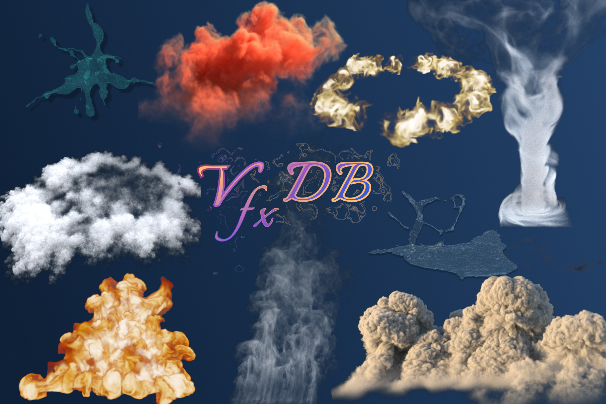

# VfxDB

This is the official repository for the VfxDB paper:

**VfxDB: A Visual Effects Volume Dataset and Benchmark for VDB-Native Generative Modeling**

We are currently preparing the release of the project code and synchronizing the full VfxDB dataset, approximately 5 TB of VDB sequence data, to public hosting infrastructure.

The codebase, benchmark resources, and dataset access instructions will be made fully available soon.
